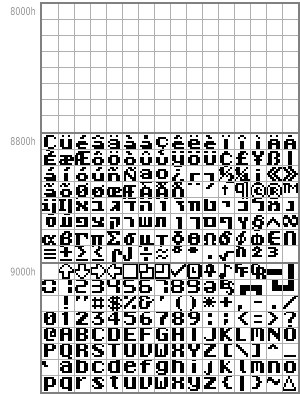
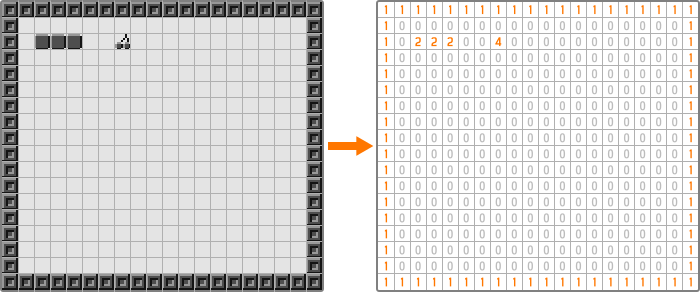
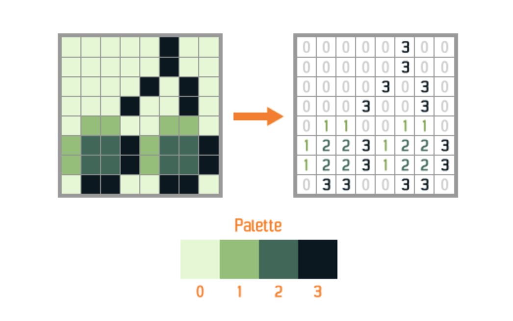
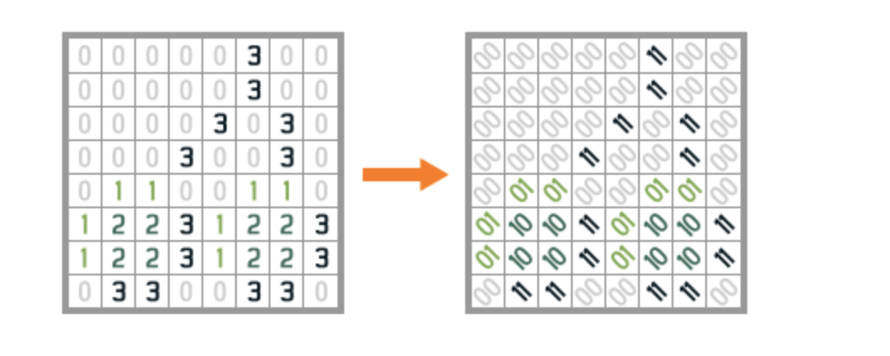
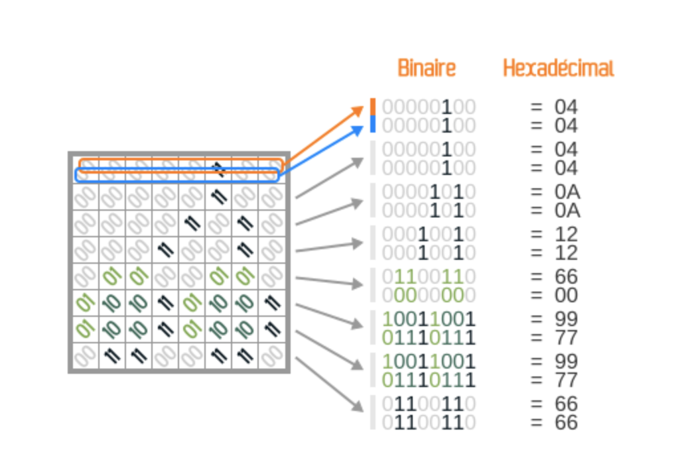
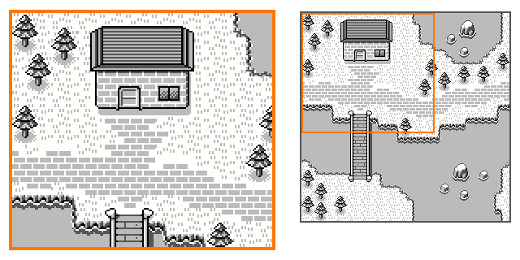

This is a small project to show how does the gameboy development works to my team.

# Install 

https://www.gbdkjs.com/docs/installation/

# Presentation 

## Inspiration

Really complete blog where you can find a much more detailed explanation over key-concepts in GameBoy Programming: 
https://blog.flozz.fr/2018/10/01/developpement-gameboy-1-hello-world/

**/!\ All the images are coming from this blog you should really take a look at this link !**

## Introduction
Some key-numbers to begin with: 

- released in 1990
- 8 ko of RAM,
- 8 ko of video memory,
- only 4 greyscales with a resolution of 160×144 pixels.

A game usually has between 32 ko and 4 Mo of ROM.

# GamePad : GBK Functions

- UINT8 waitpad(UINT8 mask): blocking execution to wait for key corresponding to the mask to be clicked.
- void waitpadup(void): blocking execusion to wait for user to release all gamepad buttons. It's particularly convenient when the user as to click 
- joypad: 

And a mask for each button: 
- J_UP,
- J_DOWN,
- J_LEFT,
- J_RIGHT,
- J_A,
- J_B,
- J_START,
- J_SELECT

Be aware that you will code on a 8-bit machine. For that reason an integer should only be 8-bit long. To do so, some recommended types are available like INT8 and UINT8. 

# Images and screen

The Gameboy screen's resolution consists of 160 * 144 pixels, but not addressable.
To edit one pixel, one must uses tiles. A tile is a square of pixel (8 * 8) that covers the screen. They can be considered as Lego to build our screen. That way we can reuse them to save some memory.
There is three different types of images used in Gameboy Programming:
- background: 32 * 32 tiles (bigger than the screen but used to enable scrolling)
- window: matching what you see on the screen in size (ie only of fraction of background)
- sprites: 1 or 2 tile-long objects (8*8 or 8*16) often used to represent characters or animated objects

## A memory issue

The Gameboy's video memory is divided in three differents domains:
- tile data: to stock images used as tiles
- background map: to store the placement of our tiles in the screen. For instance, if we can to display the tile number 1 at the position (0; 0) we have to say it here.
- zone OAM (Object Attribute Memory): to stock all the information linked to each sprite (tiles, color, position...).

### Tile data 

The memory domain corresponding to tile data is cut into three sub-domains:

/-----------------------------------\  
Sprites (128 tiles)  
/-----------------------------------\  
Sprites OR Window/Background (127 tiles)  
/-----------------------------------\  
Window/Background (128 tiles)  
/-----------------------------------\  

We can therefore use a maximum of 255 tiles for a layer. If we use 255 tiles for the background and window, we will only dispose of 128 tiles for sprites.

### Text

Now that we have seen how memory is managed on Gameboy, you should ask yourself how does our console stores characters. We have previously used the "printf" method like it was given
as a utility method but in fact, this has a great impact on our memory management... Look for yourself:



# Use a tileset

Now that we have seen how memory works it's time to create some tiles for our program.
You can use any image editor you like to create them but you will need some specific converter to transform a png image into a c code like the one store in *res/tilesets/background_window/cherry_wall.c*

Then, you place it in memory (tile data):
``` 
set_bkg_data(0, 5, CHERRY_WALL);
```

The only thing left to do is to use the tile saved in memory and indicate their position on screen:



For that, we indicate the mapping stored in *res/tilemaps/first_map.c* that will be inserted into the background map zone in memory:

``` 
set_bkg_tiles(0, 0, 20, 18, FIRST_MAP);
```

- the first two parameters gives the coordinates where we would like to place our tilemap
- the following two parameters gives us the size of our tilemap
- the last parameter is simply a pointer to our data.

Lastly, we must show the background to the user since the background is hidden by default:
```
SHOW_BKG;
```

## Wait a minute...

We quickly went over how to use our tileset. But what if I want to create mine ? How does it work ? Well, it's not that complicated, but it's not that easy as well. 

First, we map our image colors' to a number corresponding to a shade of our pallet:



Then, we convert this number in binary:



And finally, we convert this number to hex using the following schema:



A library is available to automate this process: **img2gb**

# Background 

A scrollable domain of 32 * 32 tiles.


There are two main methods useful when working with background.

The first one is:
```
void scroll_bkg(INT8 x, INT8 y);
```
using relative position

and the second one:
```
void move_bkg(UINT8 x, UINT8 y);
```

**/!\ Warning: these coordinates are in pixels !**

